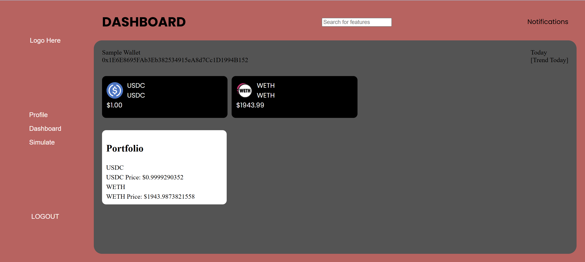

# PocketChain
This project is a full‑stack blockchain analytics dashboard built to demonstrate professional‑grade engineering skills across backend architecture, API integration, data modeling, and frontend visualization.

## Features
- Wallet‑Linked Accounts: Users create an account and associate a blockchain wallet address. The dashboard dynamically loads balances, transactions, and token metadata using Alchemy’s APIs.

- Real-Time Market Data: Live token prices and market metrics are fetched from the CoinMarketCap API and displayed in a responsive analytics panel.

## Screenshots

### Landing Page

### Real-Time Price Analytics

### Login Page

### Dashboard Page

## API Integrations
### Alchemy
Used for wallet‑specific data:
- Token Balances
- Transaction History
- Token Metadata

### CoinMarketCap
Used for:
- Real‑time Token Prices
- Market Analytics

## Future Features
- Multi‑wallet support
- Historical price charts
- Portfolio performance over time
- Token discovery + metadata pages
- Web3 signature‑based login (MetaMask)